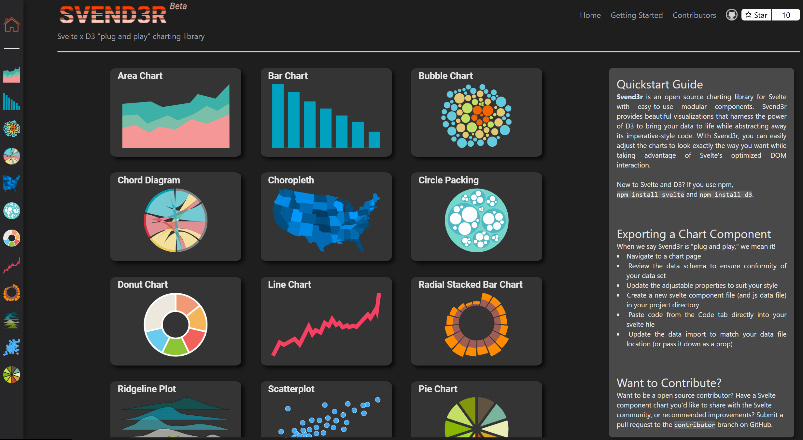
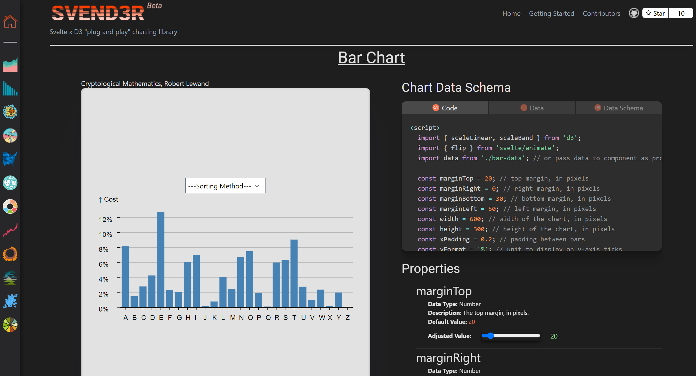
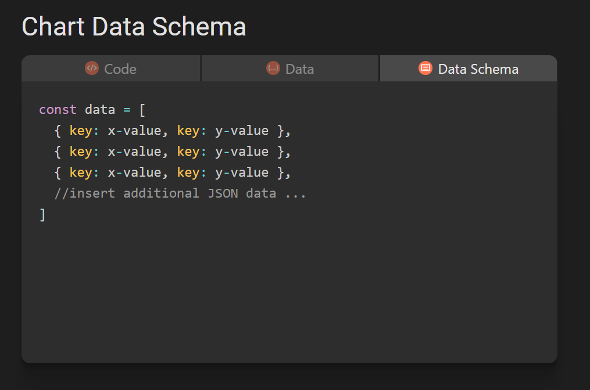
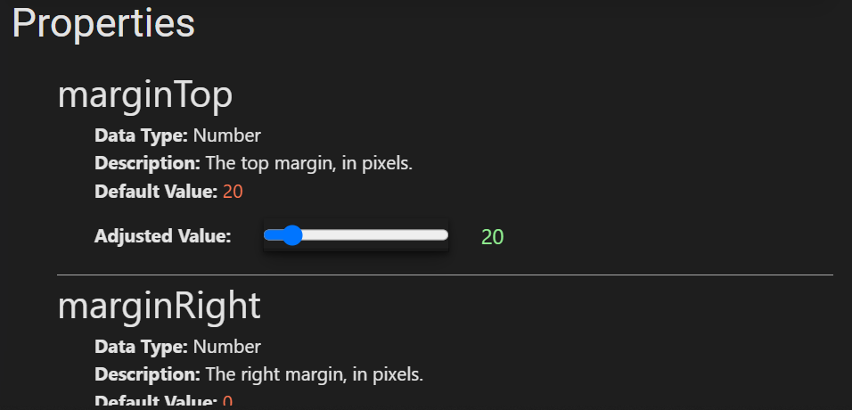
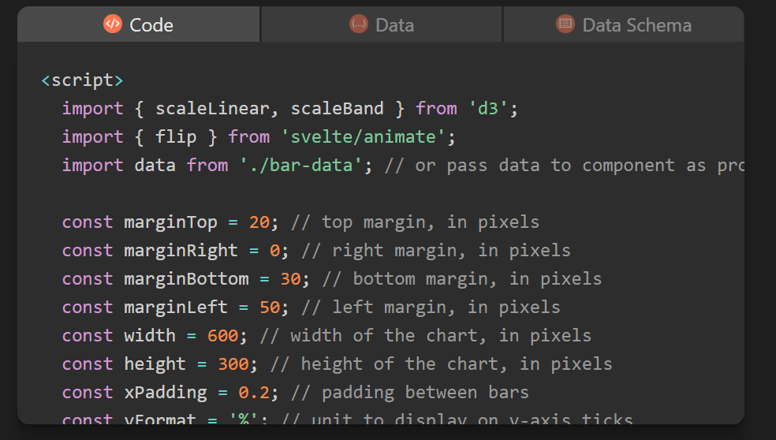
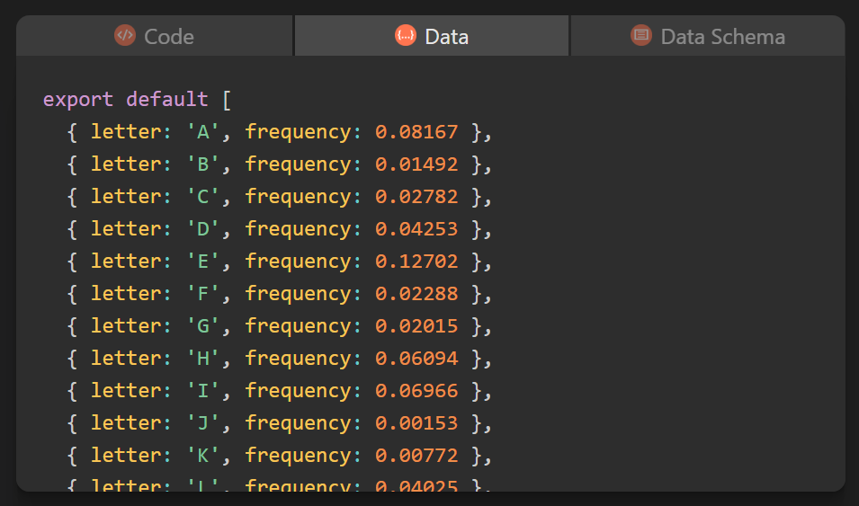
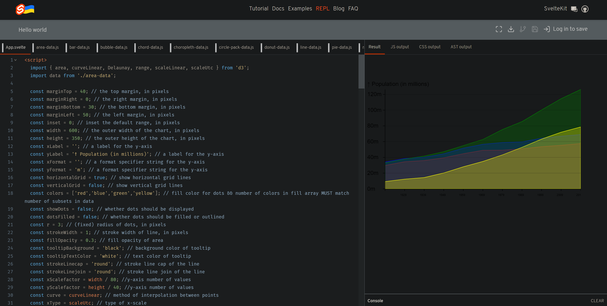

# Svend3r  v0.1.0-beta

## Introducing Svend3r, a plug and play D3 charting library for Svelte!

There are great resources for building your own charts with Svelte, including [Pancake](https://pancake-charts.surge.sh/) (from Rich Harris) and [Layer Cake](https://layercake.graphics/) (from Michael Keller), but the Svend3r team wants to make it even easier. Wouldn't you rather spend your time using charts than building them?

# How do I use Svend3r?
## - Head to the [Svend3r.dev](https://www.svend3r.dev/) homepage

## - Decide which chart works best for your application

## - Ensure your data is formatted correctly by checking the Data Schema Tab

## - Manipulate the properties to customize the look and feel of your chart

## - Copy the code and the data from the Code and Data tabs

## - Paste the code and data into a [Svelte repl](https://svelte.dev/repl/hello-world?version=3.46.5) or directly into your component

## Thats it!

# Want to Contribute?
The incredibly active, supportive community is one of the best parts of building in Svelte. Do you have a chart component you'd like to share? Notice anything missing, not working, or not available yet that you'd like to see? Submit a pull request to the contributor branch!

## Contributors 
- James Laff | [Linkedin](https://www.linkedin.com/in/jameslaff/) | [GitHub](https://github.com/jameslaff)
- Tao Chen | [Linkedin](https://www.linkedin.com/in/xtc2008/) | [GitHub](https://github.com/xtc2008)
- Isaac Saunders | [Linkedin](https://www.linkedin.com/in/isaac-l-saunders/) | [GitHub](https://github.com/IsaacLSaunders)